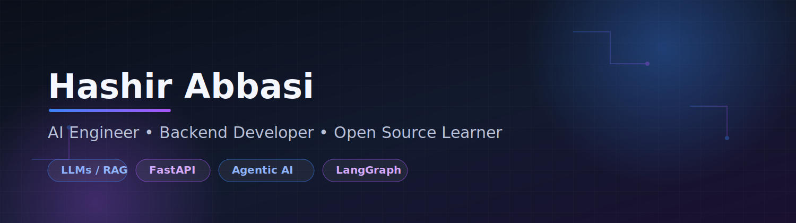

<!-- ========================= -->
<!--         BANNER            -->
<!-- ========================= -->

  

<!-- ========================= -->
<!--         HEADER            -->
<!-- ========================= -->
<h1 align="center">Hi 👋, I'm Hashir Abbasi</h1>

<h3 align="center">
MERN Stack Developer • Backend-Focused • AI &amp; Machine Learning Enthusiast
</h3>

CS student at COMSATS University Islamabad, building scalable backend systems and practical AI applications —
backed by solid foundations in DSA, OOP, Database Design, and hands-on work with LLMs, RAG, and Agentic AI.

  
  
  
  

  
  
  
  

---

### 🚀 About Me

- 🎓 BS Computer Science — **COMSATS University Islamabad**
- ⚙️ Backend-focused developer specializing in the **MERN stack** (Node.js, Express, MongoDB, React)
- 🧠 Strong fundamentals in **Data Structures & Algorithms**, **OOP**, and **Database Design**
- 🔍 Experienced implementing graph algorithms — **A\***, **Dijkstra**, **BFS**, **DFS** — for real-world routing problems
- 🤖 Exploring **AI, Machine Learning & Agentic AI** — LLMs, RAG, LangGraph, and AI agents
- ☁️ Learning **Azure AI Foundry** and cloud-native AI systems
- 💼 Actively seeking internships, collaborations, and backend/full-stack project opportunities
- 📚 Always building, learning, and shipping

---

### 🛠 Tech Stack

**Languages**

  

**Backend**

  

**Frontend**

  

**AI / ML**

  
  
  
  
  

**Databases**

  

**Tools & DevOps**

  

---

### 🌱 Currently Learning

`AI Agents` · `MCP (Model Context Protocol)` · `LangGraph` · `Azure AI Foundry` · `Docker` · `Kubernetes` · `Production AI Systems`

---

### 📌 Featured Projects

<table>
  <tr>
    <td width="50%" valign="top">
      <h4>🏥 MediLink</h4>
      AI-powered healthcare management system built with the MERN stack and the Gemini API. Features CRUD operations, ACID-compliant payment transactions, medicine stock management, and role-based access control.  
      <code>React</code> <code>Node.js</code> <code>MongoDB</code> <code>JWT</code> <code>Tailwind</code> <code>Gemini API</code>
    </td>
    <td width="50%" valign="top">
      <h4>🗺️ Islamabad Smart Mobility System</h4>
      Interactive route planning system for Islamabad using A* and Dijkstra for emergency, commute, and delivery optimization — reduced average route computation time by 40%.  
      <code>Python</code> <code>Graph Algorithms</code> <code>A*</code> <code>Dijkstra</code>
    </td>
  </tr>
  <tr>
    <td width="50%" valign="top">
      <h4>🏙️ City Resource Management System</h4>
      Java Swing GUI application for managing urban services (transport, power, emergency units), using inheritance, interfaces, composition, and design patterns for a 50% faster feature-addition cycle.  
      <code>Java</code> <code>Swing</code> <code>OOP</code> <code>Design Patterns</code>
    </td>
    <td width="50%" valign="top">
      <h4>📰 AI News Aggregator</h4>
      Intelligent news aggregation platform with semantic clustering, AI summarization, and trend detection.  
      <code>Python</code> <code>LLMs</code> <code>NLP</code> <code>FastAPI</code>
    </td>
  </tr>
  <tr>
    <td width="50%" valign="top">
      <h4>🤖 ML Loan Approval Prediction</h4>
      Loan approval classifier comparing Decision Trees, KNN, Naive Bayes, and Neural Networks for accuracy and generalization.  
      <code>scikit-learn</code> <code>Pandas</code> <code>NumPy</code>
    </td>
    <td width="50%" valign="top">
      <h4>🛒 MERN Flipkart Clone</h4>
      Full-stack e-commerce application with authentication, cart management, and complete order flow.  
      <code>MongoDB</code> <code>Express</code> <code>React</code> <code>Node.js</code>
    </td>
  </tr>
</table>

> 💡 8+ projects total — check out [my repositories](https://github.com/Asheer-abbasi01?tab=repositories) for the full list, including additional DSA and full-stack work.

---

### 📈 GitHub Stats

  
  

  

  

<!-- Contribution snake — requires a GitHub Actions workflow, see setup note below -->

  

---

### 🏆 GitHub Trophies

  

---

### 🎓 Education

**Bachelor of Science in Computer Science**
COMSATS University Islamabad — Islamabad, Pakistan

Relevant coursework: Data Structures & Algorithms · Object-Oriented Programming · Database Systems & Design · Software Engineering · Web Development · Graph Algorithms & Theory

---

### 💡 Current Focus

✅ Building AI agents &nbsp;|&nbsp; ✅ Production-grade ML &nbsp;|&nbsp; ✅ Open-source contributions &nbsp;|&nbsp; ✅ Azure AI &nbsp;|&nbsp; ✅ Backend engineering

---

### 🎯 2026 Goals

- [ ] Build 10 production-ready AI projects
- [ ] Contribute to 3+ open-source repositories
- [ ] Learn Kubernetes
- [ ] Master LangGraph & multi-agent systems
- [ ] Publish technical articles on AI engineering

---

<i>"The future belongs to those who build with AI, not just use it."</i>

⭐️ From <a href="https://github.com/Asheer-abbasi01">Asheer-abbasi01</a>

